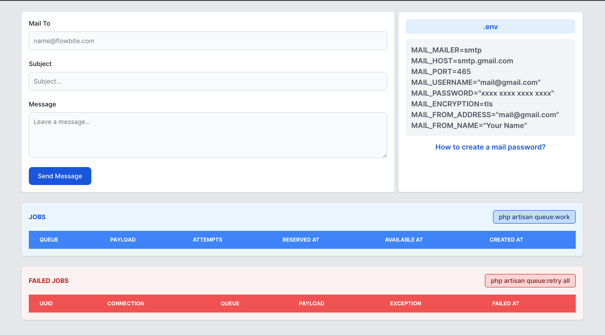

# Mastering Laravel 10 Mail with Jobs & Queues: A Comprehensive Guide

## Getting Started

Follow these instructions to get a copy of the project up and running on your local machine for development and testing purposes.

### Prerequisites

Before you begin, make sure you have the following installed on your system:

- PHP >= 8.0
- Composer
- MySQL or any other compatible database system

### Clone the Repository

Clone this repository to your local machine using the following command:

```
git clone [https://github.com/your-username/laravel-10-project.git](https://github.com/bhuvaneshcj/laravel-mail-with-job-and-queue)
```

## Screenshot


